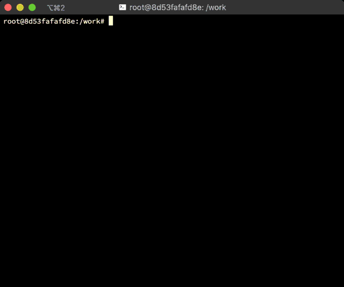

# ndevtop

`ndevtop` is a small tool to watch traffic on each network interfaces to
determine what interface exchanges much traffic.

Now this only supports Linux environment.



## Installation

Download a binary from
[Release page](https://github.com/tsukaeru/ndevtop/releases)
and put it somewhere you like.

If you'd like to build it by yourself, you can use `go get`:

```console
go get github.com/tsukaeru/ndevtop
```

## Usage

Just run

```console
ndevtop
```

shows interfaces statistics.

```console
ndevtop -h
Usage of ndevtop:
  -d interval
    	set data update interval in seconds (default 3
```

Interactive keys in the program are:

- `q`: quit
- `d`: set update interval. default is 3 seconds.
- `f`: set device name filter.
- `j`, `down allow`: move down by one row.
- `k`, `up allow`: move up by one row.
- `g`, `home`: move to the top.
- `G`, `end`: move to the bottom.
- `Ctrl-F`, `page down`: move down by one page.
- `Ctrl-B`, `page up`: move up by one page.
- `r`, `R`: sort table by RX bytes in ascendant/descendant order.
- `t`, `T`: sort table by TX bytes in ascendant/descendant order.
- `i`, `I`: sort table by RX packets in ascendant/descendant order.
- `o`, `O`: sort table by TX packets in ascendant/descendant order.

In "update interval" and "device name filter" form,

- `return`: set the inputted value.
- `escape`: abort the input form.

License

`ndevtop` is under MIT license. Please see the [LICENSE](LICENSE) file for details.
